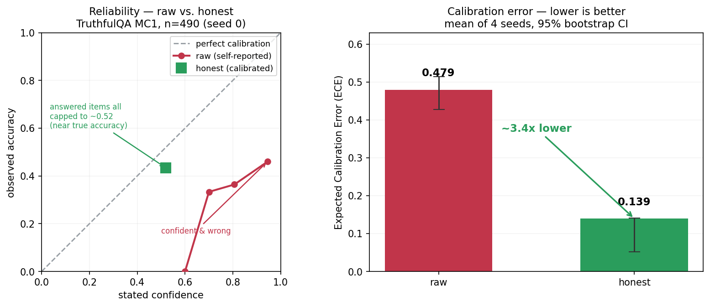

# honest-confidence

A small, deterministic **honesty layer** for LLM agents — and a reproducible eval that asks whether it actually works.

An agent should not say *"I'm 95% sure"* when the class of thing it's doing is only right ~62% of the time, and it should **abstain** rather than confidently assert a claim it can't ground. This repo extracts two such mechanisms from a running local agent, generalizes them, and — crucially — **measures them against an external labeled benchmark** to see if they improve calibration and reduce confident falsehoods, *including where they hurt*.

## The one question

> Does capping an LLM agent's stated confidence at its **measured accuracy**, plus dropping **ungrounded** claims, actually improve calibration and cut confident wrong answers on a labeled benchmark — and at what cost?

## Why this is honest (and not a demo that only shows wins)

The mechanisms come from a personal agent where the "measured rate" was the *owner's subjective approve-rate* — useful in place, but **not ground truth**. The honest move, and the whole point of this repo, is to **swap that subjective signal for a real held-out accuracy** and grade against a benchmark with known answers. We report the calibration improvement **and** the cost (correct answers lost to over-abstention). A method that only reports its wins isn't a measurement.

## What's inside

| module | what it does |
|---|---|
| `honest_confidence/calibration.py` | `calibrate_confidence(raw, measured_rate)` → deflates toward measured accuracy; **never inflates**. `fit_measured_rate()` fits the rate on a held-out split. |
| `honest_confidence/grounding.py` | abstain unless a claim resolves to **≥2 distinct supporting endpoints** (pluggable resolver). |
| `honest_confidence/refuter.py` | a zero-model gate: default-drop on spurious / trivial / analogy-quarantined claims. |
| `honest_confidence/decision.py` | the glue: `decide(question, raw_conf, evidence) → answer \| ABSTAIN, calibrated_conf, reason`. |
| `eval/run_eval.py` | one reproducible entry point: raw model vs. model+honesty-layer on **TruthfulQA**, reporting ECE, AUROC, abstention rate, accuracy-on-answered, and confident-falsehood rate. |

## The eval, briefly

- **Benchmark:** TruthfulQA (817 questions, purpose-built for *confident, imitative falsehoods*).
- **Arms:** a local model answering with self-reported confidence (**raw**) vs. the same output passed through the honesty layer (**honest**).
- **Split:** hold out 40% to fit the calibration target (measured accuracy), evaluate on the other 60%. Seeded and reported.
- **Metrics:** ECE (calibration error), AUROC (does the abstain signal separate right from wrong?), abstention rate, accuracy-on-answered, and confident-falsehood rate — raw vs. honest.

## Results (TruthfulQA MC1, n=490, seed 0)

Local model `huihui_ai/qwen2.5-abliterate:7b`; 327 questions held out to fit the model's measured accuracy (37%), 490 evaluated. **raw** = the model's self-reported confidence; **honest** = the same answers passed through the layer.



*Left — raw confidences sit high (0.6–0.97) while accuracy stays ~0.3–0.5: confidently wrong. The honesty layer caps every answered item to ~0.52, near the model's true accuracy and close to the diagonal. Right — mean ECE across 4 seeds with 95% bootstrap CIs. Both panels are generated from this repo's own results by [`eval/plot_summary.py`](eval/plot_summary.py) — nothing is hand-set.*

| metric | raw | honest | |
|---|---|---|---|
| **ECE** (calibration error, ↓ better) | 0.472 | **0.097** | ~5× on seed 0; **~3.4× mean** over 4 seeds |
| **confident-falsehood rate** (↓ better) | 0.571 | **undefined** | nothing clears the 0.70 bar once capped (see below) |
| abstention rate | 0.000 | 0.045 | |
| accuracy on answered | 0.429 | 0.434 | ~unchanged |
| AUROC (↑ better) | 0.582 | 0.510 | dipped — see limitations |

**Headline:** on answers stated at ≥0.70 confidence, the raw model was wrong **57%** of the time. The honesty layer cut calibration error **~3.4×** (mean ECE 0.48→0.14 across 4 seeds; a single lucky seed showed 5×, which the multi-seed run corrected). It also left no answer confident enough (≥0.70) to count as a confident falsehood — but that rate is **undefined, not zero**: once the cap (0.52) sits below the threshold, the "win" is by construction. ECE is the number that actually survives scrutiny. Full analysis: [WRITEUP.md](WRITEUP.md).

**Honest limitations (this is the point, not a footnote):**
1. **The cap is blunt.** It fixes *aggregate* overconfidence but not per-item discrimination — AUROC dipped to chance. (Precisely: the honest arm's AUROC scores its answer-vs-abstain gate, which abstains on only 22/490 items that aren't preferentially wrong — a near-constant signal; and its calibrated confidences are almost all exactly 0.52, so scoring those instead wouldn't help either.) The next step is per-question calibration, not one global cap.
2. **Grounding-abstain barely fired** in this closed-book setting — 21/490 (4.3%) grounding + 1 analogy-quarantine: the model's own justifications almost always clear the ≥2-endpoint bar, so the calibration cap did the work, not the grounding gate.
3. Accuracy-on-answered barely moved — abstaining removed a few wrong answers, no more.

Reproduce: `python eval/run_eval.py --n 817 --seed 0 --model <local-model>` → writes `results/results.json` + a reliability plot. Regenerate the summary figure above from existing results with `python eval/plot_summary.py`.

## Runnable demo (honest-research)

`honest_research/` is the runnable demo that ties the layer together end-to-end. It has two modes, both fail-safe (they print a legible verdict, never a traceback). Run either as `python cli.py …` or `python -m honest_research …`.

**`check`** — gate one claim/answer for honesty + calibrated confidence. This mode is pure `decide()` (no model call), so it runs anywhere:

```
$ python cli.py check "the earth is about 4.5 billion years old" \
    --evidence "radiometric dating of meteorites yields 4.5 Gyr" \
    --evidence "oldest zircon crystals date to about 4.4 billion years for earth" \
    --raw-conf 0.9

==============================================================================
CLAIM:   the earth is about 4.5 billion years old
==============================================================================
verdict:     ANSWER
grounded?:   yes
confidence:  52%  (calibrated, never inflated)
reason:
    answered; grounded and survived refutation; deflated toward measured 37%
    accuracy (n=327)
==============================================================================
```

An **ungrounded** claim (fewer than 2 distinct supporting endpoints) abstains instead of asserting:

```
$ python -m honest_research check "aliens built the pyramids" --raw-conf 0.9

verdict:     ABSTAIN
grounded?:   no (abstained)
confidence:  0%  (calibrated, never inflated)
reason:
    ungrounded: not grounded — only 0 distinct real endpoints resolved, need 2
```

(Exit code is `0` when it answers, `2` when it abstains — handy for scripting.)

**`research`** — turn a video / social URL into a factual summary + a table of claims, each carrying a **calibrated** confidence and marked `[ABSTAINED]` where the source itself doesn't ground it. Evidence for each claim is built from the source chunks that actually echo its key terms:

```
$ python cli.py research "https://youtu.be/<id>" --max-claims 6

SOURCE:  youtube
TITLE:   <video title>
SUMMARY:
  <map-reduce factual summary of what the source actually claims>

CLAIMS:  6 total  |  4 answered  |  2 abstained
------------------------------------------------------------------------------
 1. [71%]        <a claim the summary states and the source text corroborates>
 2. [ABSTAINED]  <a claim the source does not actually echo twice>
      ungrounded: only 1 distinct real endpoint resolved, need 2
 ...
```

`research` needs a local OpenAI-compatible model (Ollama by default) plus `yt-dlp`/`ffmpeg`/an OCR backend on PATH; every one of those is optional and guarded, so a missing piece degrades to a legible `error` line rather than a crash. The default model is a **non-thinking** one on purpose — qwen3.x *thinking* models return empty content over `/v1` and would silently blank the summary.

## License

MIT — see [LICENSE](LICENSE).
