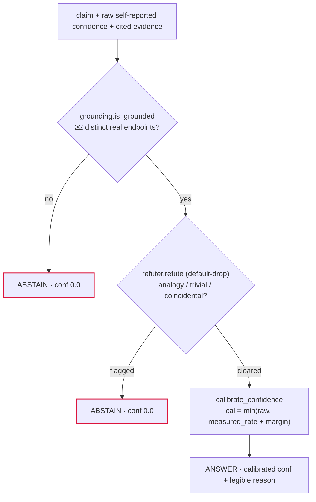

<div align="center">

# honest-confidence

**Cap an agent's stated confidence at its *measured* accuracy. Abstain on ungrounded claims. Report what that costs — not just what it wins.**

[](LICENSE)


-DC143C)


</div>

A small, deterministic honesty layer for LLM agents, plus a reproducible TruthfulQA eval that grades it two-arm — raw model vs. model-through-the-layer — and prints the regression columns next to the wins.

## Why this exists

I run a local-first personal agent, and its most dangerous failure has never been being wrong — it's being wrong **confidently**: "I'm 95% sure" on a class of task it gets right ~40% of the time. Two mechanisms in that agent already push back on this: a confidence cap and a grounding gate. But the cap deflated toward *my own subjective approve-rate* — the system grading its own homework.

This repo extracts both mechanisms, generalizes them to a dependency-free library, and makes the one change that turns a personal heuristic into a measurement: **swap the subjective rate for a real held-out accuracy**, fit on a labeled validation split, then score raw-vs-honest on a disjoint eval split. Every metric is defined so a regression (over-abstention, lost correct answers, worse ranking) shows up as readily as a win. A method that only reports its wins isn't a measurement — and this one's headline table includes a metric it made *worse*.

## How it works

Three deterministic stages composed into one gate, `decide()`. Each stage can only **abstain** — it never upgrades a later stage's confidence, never invents an answer, and any internal error abstains (fail toward silence):



- **Grounding** (`grounding.py`) — a claim is grounded iff ≥2 cited references resolve to something real *and* are distinct (one source cited twice counts once). "Is this real?" is a single injectable `resolver(ref) -> bool`; the default is deliberately dumb and transparent (a ref is real iff it appears in the supplied evidence), so the rule reproduces with no hidden database. Fails closed.
- **Refutation** (`refuter.py`) — a default-drop skeptic: a claim survives only on an explicit not-spurious verdict; anything unsure, missing, or errored is dropped. Includes a **zero-model analogy quarantine**: a claim gluing two domains by resemblance language ("X mirrors Y") states a vibe, not a shared datum, and is dropped deterministically with a legible reason — no model call. A model judge is injectable (`judge_fn`); with none supplied the gate runs deterministic-only, so any model you add is measured against that floor.
- **Calibration** (`calibration.py`) — `calibrated = min(raw, measured_rate + margin)`, with a hard invariant: **never inflates** (`calibrated ≤ raw`, always). Default margin 0.15; below 8 graded items a cold-start rule caps the rate at a cautious 0.30 prior so thin history can't oversell. `fit_measured_rate()` fits the target on held-out `(confidence, correct)` pairs.

Every verdict carries a plain-English `reason` naming what carried or sank the claim — the layer is meant to be legible, not just safe.

## Install

No packaging (`pyproject.toml`/`setup.py`) — run the scripts in place. The layer itself (`honest_confidence/`) imports nothing outside the standard library; `requirements.txt` exists only for the eval harness and the demo: `numpy`, `scikit-learn` (AUROC), `matplotlib` (reliability plots), `datasets` (TruthfulQA loader), `openai` (client for a local OpenAI-compatible endpoint, e.g. Ollama's `/v1`).

```bash
git clone https://github.com/insomniac-asif/honest-confidence
cd honest-confidence
python -m venv .venv && . .venv/bin/activate
pip install -r requirements.txt
```

## Quickstart

Gate one claim from the CLI — `check` is the pure decision path, no model, no network:

```bash
python cli.py check "the earth is about 4.5 billion years old" \
    --evidence "radiometric dating of meteorites yields 4.5 Gyr" \
    --evidence "oldest zircon crystals date to about 4.4 billion years" \
    --raw-conf 0.9
```

It prints a verdict (`ANSWER`/`ABSTAIN`), the grounding support, and a calibrated confidence with the reasoning. Fewer than two distinct supporting endpoints → abstain. Exit code `0` on answer, `2` on abstain, so it scripts cleanly. `python -m honest_research check ...` runs the same code.

From the library:

```python
from honest_confidence import calibrate_confidence
from honest_confidence.decision import decide

calibrate_confidence(0.95, measured_rate=0.37)   # -> (0.52, note): min(0.95, 0.37+0.15), never above raw
decide("the earth is ~4.5 Gyr old", raw_conf=0.9,
       evidence=["meteorite dating", "zircon dating"], measured_rate=0.37,
       answer="~4.5 Gyr")   # decide() is a gate: it passes your answer through, never invents one
# -> {'answer': '~4.5 Gyr', 'abstain': False, 'calibrated_conf': 0.52, 'reason': '...'}
```

Run the eval (needs a local OpenAI-compatible endpoint; defaults: `--base-url http://localhost:11434/v1`, `--model huihui_ai/qwen2.5-abliterate:7b`):

```bash
python eval/run_eval.py --n 50 --seed 0     # fast smoke run
python eval/run_eval.py --n 817 --seed 0    # full TruthfulQA MC1 (817 questions; --n 0 also = all)
python eval/multiseed.py --seeds 0 1 2 3 --model huihui_ai/qwen2.5-abliterate:7b
                                            # multi-seed + bootstrap CIs -> results/aggregate.json
```

`HF_HUB_OFFLINE=1` in front of a re-run skips a HuggingFace re-fetch that can hang in some environments, and `--local-json` runs the whole eval with zero HuggingFace access. There is also an end-to-end demo — `python cli.py research "https://youtu.be/<id>" --max-claims 6` turns a YouTube/TikTok URL into a claims table with every claim gated through the layer; it needs `yt-dlp` on PATH (plus `ffmpeg` and an OCR backend for TikTok) and a local model.

## Results

TruthfulQA MC1, mean over 4 seeds (0–3), local model `huihui_ai/qwen2.5-abliterate:7b`, 327 held-out questions to fit the cap and 490 evaluated per seed. The fitted measured accuracy ranged ~0.37–0.42 by seed; with margin 0.15 the seed-0 cap sits at 0.52. All numbers from [`results/aggregate.json`](results/aggregate.json) (2000-resample bootstrap):

| metric | raw | honest | reading |
|---|---|---|---|
| ECE (calibration error, ↓) | 0.479 | **0.139** | ~3.4× lower — the real win |
| AUROC (↑) | 0.577 | 0.509 | **dropped to chance — the real cost** |
| abstention rate | 0.000 | 0.048 | the gate rarely fired |
| accuracy on answered | 0.413 | 0.418 | ~unchanged |
| confident-falsehood rate (≥0.70, ↓) | 0.583 | undefined | by construction — see below |

The one number that survives scrutiny is the ECE drop. [WRITEUP.md](WRITEUP.md) is the full study — method, per-seed tables, and a section on what the result does *not* show; my first single-seed run said "~5× better" and the multi-seed run corrected it to ~3.4×.

## Limitations — the honest part

- **The confident-falsehood "win" is a tautology.** Once the cap (~0.52) sits below the 0.70 threshold, nothing counts as confident, so the honest rate is *undefined* (empty denominator) — the layer didn't stop being confidently wrong, it stopped being confident at all.
- **The cap is blunt: calibration bought at the price of discrimination.** Honest AUROC landed at 0.496–0.515 in every seed — one global cap flattens the ranking signal. Per-question calibration is the obvious next step; `corroborated_cap()` in `calibration.py` sketches one direction but is explicitly **unmeasured** — the code says so, and so do I.
- **The grounding gate is mostly untested here.** It abstained on ~5% of items: in closed-book TruthfulQA the only "evidence" is the model's own justifications, which a confabulating model happily supplies. Its value is unproven until it's run against real retrieval endpoints.
- **External validity is thin.** One weak 7B model, one benchmark, MC1 only, closed-book. The magnitudes are specific to a very overconfident ~40%-accurate model; a stronger, better-calibrated model gives the cap less to fix and more to break.
- **The layer has no unit tests — the eval is its verification.** The one test module in the repo, `tests/test_fetch_dispatch.py` (5 test functions, 22 parametrized cases; run with `pytest`, which is not in `requirements.txt`), is a security regression for the demo's URL dispatcher — it must key on the parsed hostname, never a URL substring.
- Per-item results for seeds 1–3 are checked in under `results/seeds/`; seed 0's per-item file is not — its metrics live inside `aggregate.json`.

## Repo map

| path | what |
|---|---|
| `honest_confidence/` | the layer — `calibration.py`, `grounding.py`, `refuter.py`, `decision.py`; stdlib-only |
| `eval/` | TruthfulQA harness — `run_eval.py`, `multiseed.py`, `metrics.py`, `model_client.py`, `plot_summary.py` |
| `honest_research/` | runnable demo — URL → honesty-gated claims table (`cli.py` is the front-end) |
| `results/` | checked-in eval output — `aggregate.json`, per-seed results, summary plot |
| `WRITEUP.md` | the full study, including everything the numbers do **not** show |

---

Part of [Absent Born Labs](https://absentbornlabs.org) · more at [github.com/insomniac-asif](https://github.com/insomniac-asif)
