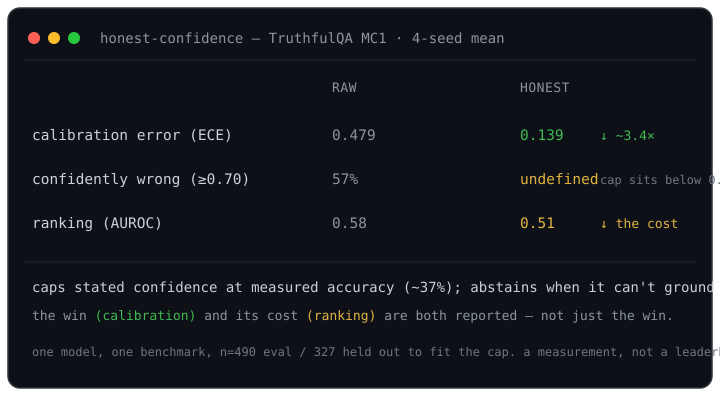

# honest-confidence

**Your agent says "i'm 95% sure." the class of thing it's doing is right ~37% of the time. does capping its stated confidence at its *measured* accuracy — and abstaining when it can't ground a claim — actually fix the overconfidence, or just move the problem?**
`honest-confidence` is a small, deterministic honesty layer for LLM agents, plus a reproducible TruthfulQA eval that answers that with numbers — *including where the layer hurts*.

[](LICENSE)
[](requirements.txt)
[](#the-eval)
[](#results-truthfulqa-mc1-4-seed-mean)

<p align="center">
  
</p>

---

## Why this exists

An agent should not say *"i'm 95% sure"* when the class of thing it's doing is only right ~37% of the time, and it should **abstain** rather than confidently assert a claim it can't ground. This repo extracts two such mechanisms from a running local agent, generalizes them, and — crucially — **measures them against an external labeled benchmark** instead of showing a demo that only shows wins.

The honest part is where the mechanisms came from. In the original agent, the "measured rate" was the *owner's subjective approve-rate* — useful in place, but **not ground truth**. The whole point of this repo is to **swap that subjective signal for a real held-out accuracy** and grade against a benchmark with known answers, reporting the calibration improvement **and** the cost (correct answers lost to over-abstention). A method that only reports its wins isn't a measurement.

## The one question

> Does capping an LLM agent's stated confidence at its **measured accuracy**, plus dropping **ungrounded** claims, actually improve calibration and cut confident wrong answers on a labeled benchmark — and at what cost?

## What's inside

The layer (`honest_confidence/`) is **stdlib-only** — no numpy, no model, no network. The pip dependencies exist only for the eval harness and the local-model demo.

| module | what it does |
|---|---|
| `honest_confidence/calibration.py` | `calibrate_confidence(raw, measured_rate)` → deflates toward measured accuracy; **never inflates**. `fit_measured_rate()` fits the rate on a held-out split. |
| `honest_confidence/grounding.py` | `is_grounded(...)` — abstain unless a claim resolves to **≥2 distinct supporting endpoints** (pluggable resolver). |
| `honest_confidence/refuter.py` | `refute(...)` — a zero-model gate: default-drop on spurious / trivial / analogy-quarantined claims. |
| `honest_confidence/decision.py` | the glue: `decide(question, raw_conf, evidence, measured_rate) → {answer \| None, abstain, calibrated_conf, reason}`. Fail-safe: any error abstains. |
| `eval/run_eval.py` | one reproducible entry point: raw model vs. model+honesty-layer on **TruthfulQA**, reporting ECE, AUROC, abstention rate, accuracy-on-answered, and confident-falsehood rate. |
| `eval/multiseed.py` / `eval/plot_summary.py` | run the eval across seeds → `results/aggregate.json`; regenerate the summary figure from existing results. |

## Install

There is no packaging (`pyproject.toml`/`setup.py`) — you run the scripts in place:

```bash
git clone https://github.com/insomniac-asif/honest-confidence
cd honest-confidence
python -m venv .venv && . .venv/bin/activate
pip install -r requirements.txt
```

Five deps: `numpy`, `scikit-learn`, `matplotlib`, `datasets` (the eval + metrics + reliability plot) and `openai` (the local OpenAI-compatible model client). Developed on Python 3.13; the dependency floors want a modern Python 3 (≈3.9+). The honesty *layer* itself (`honest_confidence/`) imports none of these — only the eval and the demo do.

## Quickstart

The layer's decision path (`decide()`) needs **no model and no network**, so you can gate a claim anywhere. The `check` CLI is a thin front-end over it (real output):

```
$ python cli.py check "the earth is about 4.5 billion years old" \
    --evidence "radiometric dating of meteorites yields 4.5 Gyr" \
    --evidence "oldest zircon crystals date to about 4.4 billion years for earth" \
    --raw-conf 0.9

==============================================================================
CLAIM:   the earth is about 4.5 billion years old
==============================================================================
verdict:     ANSWER
grounded?:   yes
confidence:  52%  (calibrated, never inflated)
support:     grounded — 2 distinct real endpoints resolved (needed 2):
             radiometric dating of meteorites yields 4.5 Gyr, oldest zircon
             crystals date to about 4.4 billion years for earth
reason:
    answered; grounded and survived refutation; deflated toward measured 37%
    accuracy (n=327)
==============================================================================
```

An **ungrounded** claim (fewer than 2 distinct supporting endpoints) abstains instead of asserting:

```
$ python -m honest_research check "aliens built the pyramids" --raw-conf 0.9

verdict:     ABSTAIN
grounded?:   no (abstained)
confidence:  0%  (calibrated, never inflated)
reason:
    ungrounded: not grounded — only 0 distinct real endpoints resolved, need 2
    (abstaining)
```

Exit code is `0` when it answers, `2` when it abstains — handy for scripting.

Or from the library:

```python
from honest_confidence import calibrate_confidence
from honest_confidence.decision import decide

calibrate_confidence(0.95, measured_rate=0.37)   # -> deflated toward 0.37, never above raw
decide("the earth is ~4.5 Gyr old", raw_conf=0.9,
       evidence=["meteorite dating", "zircon dating"], measured_rate=0.37)
# -> {'answer': ..., 'abstain': False, 'calibrated_conf': 0.52, 'reason': '...'}
```

## The eval

The layer's job is empirical, so it's graded empirically — not with a unit test.

- **Benchmark:** TruthfulQA (817 questions, purpose-built for *confident, imitative falsehoods*).
- **Arms:** a local model answering with self-reported confidence (**raw**) vs. the same output passed through the honesty layer (**honest**).
- **Split:** hold out ~40% to fit the calibration target (the model's measured accuracy), evaluate on the rest. Seeded and reported.
- **Metrics:** ECE (calibration error), AUROC (does the abstain signal separate right from wrong?), abstention rate, accuracy-on-answered, and confident-falsehood rate — raw vs. honest.

## Results (TruthfulQA MC1, 4-seed mean)

Local model `huihui_ai/qwen2.5-abliterate:7b`; 327 questions held out per seed to fit the model's measured accuracy (~37%), 490 evaluated. **raw** = the model's self-reported confidence; **honest** = the same answers passed through the layer. Numbers below are the **mean over 4 seeds** (0–3), read straight from `results/aggregate.json`.

| metric | raw | honest | |
|---|---|---|---|
| **ECE** (calibration error, ↓ better) | 0.479 | **0.139** | **~3.4×** lower (seed 0 alone: 0.472→0.097, ~5× — a lucky seed the multi-seed run corrected) |
| **confident-falsehood rate** (↓ better) | 0.58 | **undefined** | nothing clears the 0.70 bar once capped (see below) |
| abstention rate | 0.000 | 0.048 | |
| accuracy on answered | 0.413 | 0.418 | ~unchanged |
| AUROC (↑ better) | 0.577 | 0.509 | **dipped to ~chance** — see limitations |

**Headline:** on answers stated at ≥0.70 confidence, the raw model was wrong ~57% of the time (seed 0; ~58% mean). The honesty layer cut calibration error **~3.4×** (mean ECE 0.479→0.139 across 4 seeds; one lucky seed showed ~5×, which the multi-seed run corrected). It also left no answer confident enough (≥0.70) to count as a confident falsehood — but that rate is **undefined, not zero**: once the cap (~0.52) sits below the 0.70 threshold the denominator is empty, so the "win" is by construction. **ECE is the number that actually survives scrutiny.** Full analysis: [WRITEUP.md](WRITEUP.md).

**Honest limitations (this is the point, not a footnote):**

1. **The cap is blunt.** It fixes *aggregate* overconfidence but not per-item discrimination — AUROC dipped to chance. (The honest arm's AUROC scores its answer-vs-abstain gate, which abstains on only ~24/490 items that aren't preferentially wrong — a near-constant signal; and its calibrated confidences are almost all ~0.52, so scoring those wouldn't help either.) The next step is per-question calibration, not one global cap.
2. **Grounding-abstain barely fired** in this closed-book setting (~4–5%): the model's own justifications almost always clear the ≥2-endpoint bar, so the calibration cap did the work, not the grounding gate.
3. **Accuracy-on-answered barely moved** — abstaining removed a few wrong answers, no more.
4. **One model, one benchmark, closed-book.** These numbers describe `qwen2.5-abliterate:7b` on TruthfulQA MC1, not calibration in general. A different model or an open-book setting could move all of them.

## How it works

The layer is a short pipeline where **each stage can only ABSTAIN, never upgrade a later stage's doubt**:

```
raw self-reported conf  +  cited evidence
        |
        v
  grounding.is_grounded  -- <2 distinct endpoints? ------> ABSTAIN (conf 0.0)
        |
        v
  refuter.refute         -- spurious / analogy-quarantined? --> ABSTAIN (conf 0.0)
        |
        v
  calibration.calibrate_confidence(raw, measured_rate)   -> deflate toward measured accuracy (never inflate)
        |
        v
  decide()  ->  {answer, calibrated_conf, reason}
```

The eval wraps that in a measurement:

```
TruthfulQA  ->  split: fit measured_rate on held-out ~40%  ->  evaluate the rest
     raw arm:    the model's self-reported confidence
     honest arm: the same answers through the layer
  ->  ECE, AUROC, abstention, accuracy-on-answered, confident-falsehood   (raw vs honest)
```

`calibrate_confidence` deflates toward the measured rate with a margin (so it caps near ~0.52 for a 37%-accurate model, not all the way to 0.37) and is clamped so it can never exceed the raw confidence — the layer can lower a claim's confidence, never raise it.

## Runnable demo (honest-research)

`honest_research/` ties the layer together end-to-end. Both modes are fail-safe (they print a legible verdict, never a traceback). Run either as `python cli.py …` or `python -m honest_research …`.

**`check`** — gate one claim/answer for honesty + calibrated confidence. Pure `decide()`, no model call (this is the Quickstart above).

**`research`** — turn a video / social URL into a factual summary + a table of claims, each carrying a **calibrated** confidence and marked `[ABSTAINED]` where the source itself doesn't ground it. Evidence for each claim is built from the source chunks that actually echo its key terms:

```
$ python cli.py research "https://youtu.be/<id>" --max-claims 6

SOURCE:  youtube
TITLE:   <video title>
SUMMARY:
  <map-reduce factual summary of what the source actually claims>

CLAIMS:  6 total  |  4 answered  |  2 abstained
------------------------------------------------------------------------------
 1. [71%]        <a claim the summary states and the source text corroborates>
 2. [ABSTAINED]  <a claim the source does not actually echo twice>
      ungrounded: only 1 distinct real endpoint resolved, need 2
 ...
```

`research` needs a local OpenAI-compatible model (Ollama by default) plus `yt-dlp`/`ffmpeg`/an OCR backend on PATH; every one of those is optional and guarded, so a missing piece degrades to a legible `error` line rather than a crash. The default model is a **non-thinking** one on purpose — qwen3.x *thinking* models return empty content over `/v1` and would silently blank the summary.

## Verification

There is deliberately **no pytest suite** here (no `tests/`, zero test functions), and no "tests passing" badge to go with it. A green checkmark on hand-tuned unit tests wouldn't answer the only question that matters — *does the honesty layer actually improve calibration on real, unseen questions, and what does it cost?* That claim is empirical, so the check is the **eval itself**, run end-to-end and reported with every number above (wins and costs).

Reproduce:

```bash
# single seed -> results/results.json + a reliability plot (default --n 50; use --n 817 for the full set)
python eval/run_eval.py --n 817 --seed 0 --model huihui_ai/qwen2.5-abliterate:7b

# the 4-seed aggregate quoted above -> results/aggregate.json
python eval/multiseed.py

# regenerate the summary figure straight from existing results (nothing hand-set)
python eval/plot_summary.py
```

The model-free `check` path needs nothing external; the eval arms need a local model serving an OpenAI-compatible endpoint (e.g. Ollama at `http://localhost:11434/v1`).

## License

MIT — see [LICENSE](LICENSE). © 2026 Asif.
